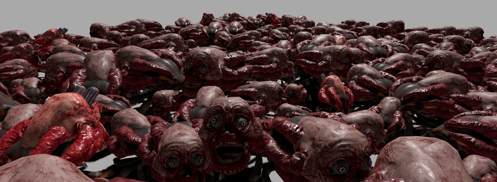
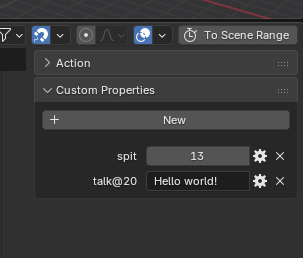

Play demo: [https://bandinopla.github.io/threejs-instancedanimatedmesh/](https://bandinopla.github.io/threejs-instancedanimatedmesh/)

# Instanced Animated Mesh

Wrapper with some sintax sugar around threejs example [webgpu_skinning_instancing_individual](https://github.com/mrdoob/three.js/pull/33644) originally done by [RenaudRohlinger](https://github.com/RenaudRohlinger) to allow the instancing of multiple animated skinned meshes. All instances share one skeleton but can play diferent animations.

## Added features
- nicely packed into a class
- Nice api to interact with the instances
- Support for normal maps 
- Supports frame scripts
- Multiple animation tracks per instance including additive clips
- Hooks to modify and read the skeleton before and after animation

## Requirements
It uses `THREE.WebGPURenderer` from `three/webgpu`

## Install

##### npm
```bash
npm install threejs-instancedanimatedmesh
```

#### pnpm
```bash
pnpm add threejs-instancedanimatedmesh
```

#### yarn
```bash
yarn add threejs-instancedanimatedmesh
```

#### bun
```bash
bun add threejs-instancedanimatedmesh
```

## Setup

This is the main object that will "contain" the instances. Usually added to the center of scene.
```js
import { InstancedAnimatedMesh } from "threejs-instancedanimatedmesh";
const imesh = new InstancedAnimatedMesh(
	scene.getObjectByName("character-rig"),
	character.animations, // AnimationClip[]
	total, // how many to create
	24 // FPS used when authoring the animation clips
);
scene.add(imesh); 

// and in your render loop...
imesh.update(deltaTime, renderer);
```

### Use
```js
const character = imesh.getInstance(); //returns a handy Object3D that acts as the proxy of the instance

character.gotoAndPlay("idle"); // will play and loop...
character.gotoAndPlay("Breathing", { channel:"decorative" });
character.getBone("BoneHandBone").add(swordObject); // easily add stuff to the bones of this instance 

// IMPORTANT: if you change position, scale or rotation, call this: 
character.needsUpdate = true; // so the instance position gets updated, otherwise you will the the instance not moving at all, frozen in space.

```

## Play once vs loop
- `gotoAndStop` : will play the clip and when the end is reached it will stay at the last frame.
- `gotoAndPlay` : will loop

## Additive clips
Make sure the `AnimationClip`has either `userData.additive` set to:

- `true` ( in that case the reference frame will be frame 1 of that clip ) 
- OR set it to the name of the clip you want to use as reference pose (frame 1 of that clip will be used)  

> In blender terms, you go to the properties of the animation clip in the Action Editor and create in the custom properties side pannel a boolean property called "additive" and set it to true. Don't forget to ckeck the "export custom properties" in the GLB exporter settings or whatever other format you use...

And when playing them, you will want them to run on channels different from the main one, you do that by doing:
```js
character.gotoAndPlay("Breathing", { channel:"decorative" });
```
That will play on top of the "main" default channel but if the clip was set to additive, the animation will be applied "on top" the main pose so it will not override it.

## Frame scripts
The `AnimationClip` can hold data in it's `userData`, so what this class does is to scan the properties if that object and treat them as animation event names. It expects 2 formats:
1. By default, any property is considered an event, and the value is expected to be a number, the frame in which it should be emited. In frame format (not time)
2. If the property contains a "@" it will assume format : `<eventName>@<frame>` and the value a number, the frame in which should be emitted.
3. A hardcoded frame script `$complete` will be called when the end of the clip is reached.

#### In Blender...
when you export as .glb turn on `include custom properties` and in the Action Editor create your animation events like this:


In that screenshot the event "spit" will trigger at frame 13. 

### Execute script...
The config object of the play methods can have a map "frameScript" where props are the event name and value the functions that will be executed when that event key is reached in the instance's animation clip.
```js
character.gotoAndStop("spit-anim", {

	// this object has a map of expected event names as keys
	// the value is the function to call when the event is triggered
	frameScript: {
		spit: ()=>console.log("Spit!!")

		// with a payload using format <event>@<frame> : <payload>
		talk: ( msg )=>console.log(`Char says: ${msg}`)
	}
});
```

## Access the bones
The way in which you can access the bones of the instance and add stuff to them is: 
```js
character.getBone("Bone"); // will return a proxy Object3D
```
and then you can add stuff to it. Remember each instance share the same bones, so what that method does is to create a proxy for that bone inside of the instance's proxy object and will keep it in sync with it so if you add stuff to it it will move with the bone as the character moves.


## Hook / Modify skeleton's pose
After the animation has posed the skeleton for the instance, you can hook right after it before the final pose is set and change the bones ( useful to implement IK mechanic )

```js
let rot = 0;
character.modifyPose((api) => {
	rot += 0.01;
	api.getBoneByName("HeadBone").rotation.y = rot;
});
```

The "api" objects offers:
| method | description |
|------|-----|
|`getBoneMatrix( boneName)` | Returns the world transformation matrix of a specific bone for a given instance. This method combines the instance's transform with the current animated pose of the requested bone, producing a matrix that represents where that bone is in world space. It is useful for attaching objects such as weapons, particle effects, lights, or other meshes to animated bones on individual instances. | 
| `getBoneByName(boneName)` | Returns the reference to the actual Bone of the main skeleton | 
| `placeAtBone(bone, object)` | Places an object at the bone's world position | 

Throws an error if the specified bone does not exist.

## Questions?
[@bandinopla](https://x.com/bandinopla)
